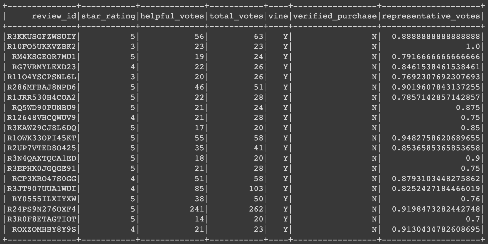
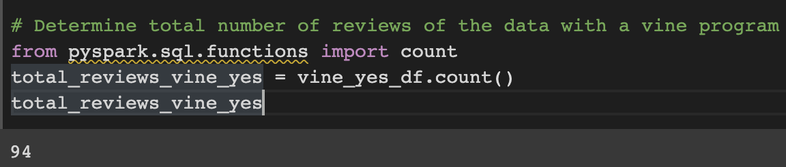
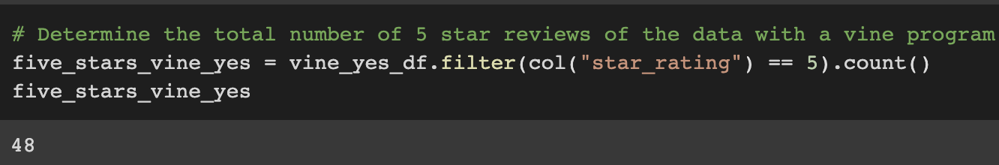
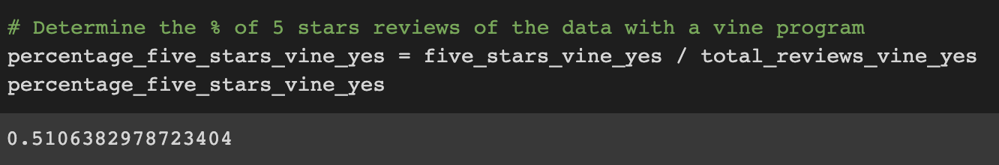
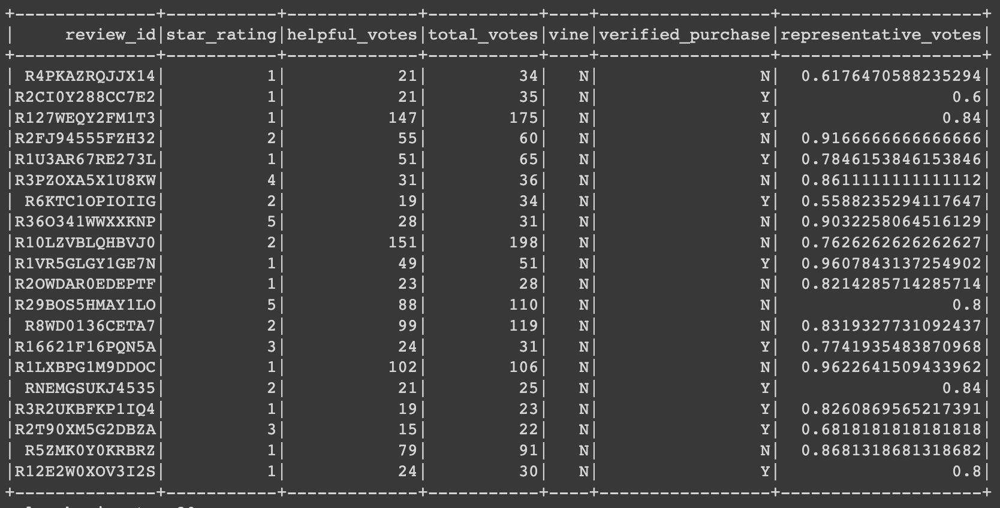
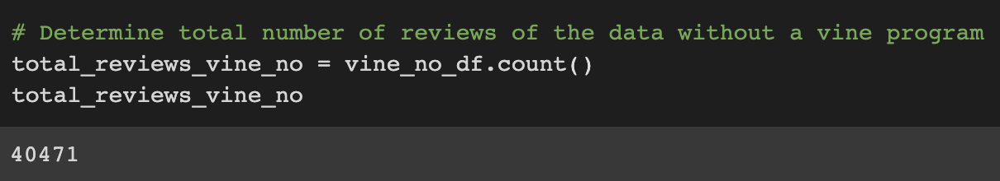
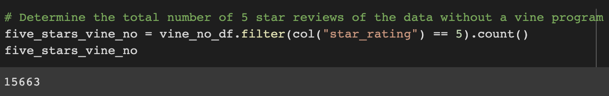
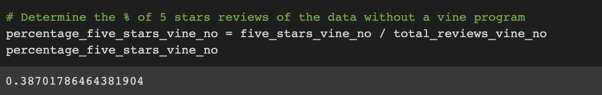

# **ANALYSIS OVER THE AMAZON VINE PROGRMAM**

## ***OVERVIEW***

### The purpose of this analysis is to provide SellBy with enough information to determine whether there is a bias towards favorable reviews from Vine members.

## ***Vine Reviews***

### From this data we can get the following information:

### **1. The total reviews we have that included a Vine review is 94 as we can see below:

### **2. The number of 5 stars reviews for the Vine cases is 48 as shown in the following image:

### **3. The percentage of the 5 stars reviews in the Vine case is 51.6% as can be seen as follows:

## ***Non-Vine Reviews***

### From this data we can get the following information:

### **1. The total reviews we have that did not include a Vine review is 40,471 as we can see below:

### **2. The number of 5 stars reviews for the non-Vine cases is 15,663 as shown in the following image:

### **3. The percentage of the 5 stars reviews in the non-Vine case is 38.7% as can be seen as follows:

## ***SUMMARY***

### Based on the exposed results above, we can conclude that there is a positivity bias for reviews in the Vine program explained by the fact that 51.7% of the reviews are rated as 5 stars compared to only 38.7% for the non-Vine cases. This could be explained due to the fact that there is an economic implication to give a better review for the paid cases.

### Another analysis we could do to support this conclusion would be a sentiment analysis by classifying the review_body comments as negative or positive and determine the % of positive comments vs total for both Vine and non-Vine cases.